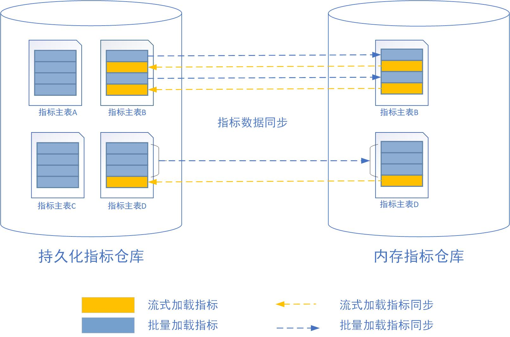
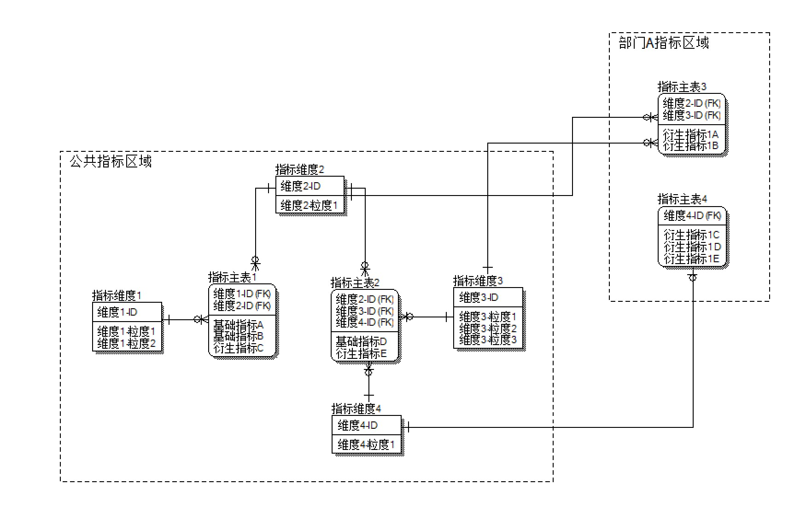

= 指标管理系统需求分析和总体设计
肖燏 <yu.xiao@seaboxdata.com>
v1.0
:toc:

== 系统概述
指标管理系统的主要作用是帮助用户充分挖掘大数据平台中海量数据的价值，根据用户的业务需求，将来自不同渠道、形式和结构各异的数据经过加工、整理，转变为为易于分析和使用的多维数据指标，为用户提供完整、及时、灵活响应需求的数据视图。

指标管理系统具备以下主要特点：

* 支持从多种指标数据源加载指标数据。
* 支持自由定义的指标维度。
* 支持流式和批量的指标数据加载方式。
* 支持指标数据查询分析，支持自定义数据仪表板。
* 支持自定义指标体系，支持公共指标体系和私有指标体系。
* 支持精细化的指标数据访问权限控制。
* 支持自定义指标计算公式。
* 支持通过数据接口对外提供指标数据。

== 系统业务模型

=== 基本概念

* 指标数据源：指标数据源表示基础指标的数据来源。指标数据源可以是关系数据库、本地或远程文件系统、消息队列或NoSQL数据库。
* 基础指标：指能够从指标数据源中的数据直接计算得到的指标，基础指标的计算不依赖于其他指标。基础指标由专职部门部门进行维护，对所有部门可见。
* 衍生指标：指使用基础指标或其他衍生指标的值，经过用户定义的运算而得到的指标。指标管理的专职部门和各业务部门都可以定义衍生指标，专职部门定义的衍生指标对所有部门可见，各业务部门定义的衍生指标只对本部门可见。
* 指标目录：是对基础指标和衍生指标进行的多级分类。指标目录中可以包含子目录或者具体指标，但不能两者兼有，指标只能包含在最下层指标目录中。
* 指标体系：指标体系代表从根节点开始的一颗完整的指标目录树及目录下所涵盖的指标。专职部门维护的指标体系为公共指标体系，对所有部门可见，业务部门维护的指标体系只对本部门可见。指标体系中涵盖的指标都是对指标库中指标的引用。
* 指标库：用户定义的所有基础指标和衍生指标的集合，包括专职部门定义的公共指标（基础指标和衍生指标）和业务部门定义的私有衍生指标。其中业务部门定义的衍生指标只能被本部门的指标体系引用。
* 指标维度：指标可以拥有多个维度，如时间周期、管理机构（地区）等。维度可以包含多级粒度。所有指标都至少具备时间周期维度和管理机构（或地区）维度，可以根据需要增加其他维度。衍生指标的维度是它所引用的基础指标或其他衍生指标的公共维度以及粒度的子集。
* 指标仓库：用于存放指标数据的数据库，指标仓库中包括指标主表和指标维表，指标维表存储指标维度数据，指标主表存放指标度量数据，公共指标和私有指标分别存放在不同的指标主表中。根据指标加载和使用方式的不同，指标仓库在物理上包括持久化指标仓库和内存指标仓库两部分。

=== 业务流程

.指标管理系统业务流程
image::business-flow.jpg[align=center, width=80%]

=== 用户角色
系统设置下列用户角色：

* 普通用户：使用指标管理系统进行指标数据查询和分析的人员。
* 公共指标维护人员：负责维护公共指标体系和公共指标，包括基础指标和衍生指标。
* 部门指标维护人员：负责维护本部门指标体系和私有指标。
* 公共指标管理人员：负责审核对公共指标体系和公共指标的调整，以及对指标接口的审核。
* 部门指标管理人员：负责审核对部门指标体系和私有指标的调整，以及对指标接口的审核。
* 指标系统管理人员：负责指标管理系统的运行维护，包括数据源管理、指标仓库管理、指标接口管理。
* 指标数据安全管理人员：负责设置指标数据的安全级别和各用户岗位的数据访问权限。

=== 角色职责矩阵
.系统角色职责矩阵

== 系统数据模型

参见**指标管理系统.erwin**。

== 系统技术架构

.系统技术架构图

=== 指标批量加载引擎
指标批量加载引擎的作用是计算和加载需要定期更新或补充的指标数据。引擎执行的周期取决于业务的要求和指标数据源的数据粒度。
指标批量加载引擎由作业调度引擎启动，执行参数包括：

. 需要计算的基础指标集合，如果不指定则计算所有基础指标。
. 系统参数列表，如数据日期、数据时间等。

.处理流程
image::batch-metric-load.jpg[align=center, width=40%]

==== 标记指标计算次序

.伪代码
----
将所有衍生指标计算次序设置为-1
将所有基础指标计算次序设置为0
SET LAST_CALC_ORDER = 0
WHILE 能够找到满足以下标准的指标:
        直接依赖于计算次序为LAST_CALC_ORDER的指标 AND
        本身的计算次序 <= LAST_CALC_ORDER
    将这些指标的计算次序设置为LAST_CALC_ORDER + 1
    SET LAST_CALC_ORDER = LAST_CALC_ORER + 1
END WHILE
----

==== 基础指标计算
基础指标数据加载利用用户配置的带参数的指标加载语句(SQL)从指定的数据源提取指标数据。指标加载语句（SQL）需要满足以下要求：
. SELECT表达式中需要包含指标主表的该指标度量字段和该指标所具备的维度的全部粒度字段。
. 语句的结果应该是该指标各维度上最细粒度的数据（粒度可以高于维度所定义的最细粒度）。

.伪代码
----
替换基础指标加载语句中的参数
创建指标临时表 // <1>
执行基础指标加载语句，将结果插入临时表 // <2>
INSERT INTO <指标主表> (<维度1-ID>，<维度2-ID>，……，<维度N-ID>，0，0，……，<指标字段M>，……，0)
SELECT <维度1-ID>，<维度2-ID>，……，<维度N-ID>，<指标值M>
FROM <临时表>, <维度表1>, <维度表2>, ……，<维度表N>
WHERE
    临时表中所有和维度表1相关的维度字段 = 维度表1所有粒度字段 AND
    临时表中所有和维度表2相关的维度字段 = 维度表2所有粒度字段 AND
    ……
    临时表中所有和维度表N相关的维度字段 = 维度表N所有粒度字段 AND
ON DUPLICATE SET <指标字段M> = <指标值M>
----
<1> 该临时表中的字段包括指标维度字段和度量字段。度量字段存放计算出的指标值，字段名与指标主表中该指标对应的字段名称相同。维度字段中需要包含该指标涉及的维度的所有粒度字段。
<2> 对于粒度小于该基础指标的粒度字段，需要填入NULL，例如日期维包含年、月、日三个粒度，如果指标本身粒度为月，则和日粒度对应的字段填NULL；粒度大于该基础指标的粒度字段需要填入与维度表中的维度数据一致的值。

===== 衍生指标计算
衍生指标的值通过执行用户配置的指标计算公式得到。指标计算公式中可以引用其他的基础指标或衍生指标。系统根据指标之间依赖关系的配置自动对指标的计算顺序进行合理的安排。衍生指标所依赖的指标的维度必须与该衍生指标相同。

.伪代码
----
将指标计算公式中引用的其他指标编号替换为对应的指标主表字段名
找出该衍生指标的所有依赖指标所在的指标主表名称
INSERT INTO <指标主表> (<维度1-ID>，<维度2-ID>，……，<维度N-ID>，0，0，……，<指标字段M>，……，0)
SELECT 源指标主表1的所有维度ID字段，<指标计算公式>
FROM <源指标主表1>, <源指标主表2>, ……，<源指标主表N>
WHERE
    源指标主表1的所有维度ID字段 = 源指标主表2的所有维度ID字段 AND
    源指标主表1的所有维度ID字段 = 源指标主表3的所有维度ID字段 AND
    ……
    源指标主表1的所有维度ID字段 = 源指标主表N的所有维度ID字段
ON DUPLICATE SET <指标字段M> = <指标值M>
----

==== 指标沿维度粒度汇总

===== 指标维度表汇总记录计算
.伪代码
----
INSERT INTO <维度表名称> (粒度1，粒度2，……，粒度N) // <1>
SELECT * FROM
(
    SELECT 粒度1，粒度2，……，粒度N
    FROM <维度表名称>
    GROUP BY 粒度1，粒度2，……，粒度N
    WITH ROLLUP
) T
WHERE
粒度1 IS NULL
OR 粒度2 IS NULL
……
OR 粒度N IS NULL
;
----
<1> 粒度从 1~N 逐渐细化。

===== 指标主表度量字段从各维度向上汇总
.伪代码
----

FOR 指标主表的所有维度：
    SET dim_id = 当前汇总的维度ID字段
    SET <其他维度ID字段列表> = 主表中除了当前汇总的维度ID之外的维度ID字段列表 // <1>
    SET <汇总粒度字段列表> = 当前维度除最细粒度外其他粒度字段列表 // <2>

    INSERT INTO <主表名称> (dim_id, <其他维度ID字段列表>, <度量字段列表>)
    SELECT <维度表名>.id as dim_id, <其他维度ID字段列表>, <度量字段列表>
    FROM (
        SELECT <其他维度ID字段列表>, <汇总粒度字段列表>, NULL as <最细粒度字段>, 
            SUM(度量字段1) as <度量字段1>, SUM(度量字段2) as <度量字段2>，……，SUM（度量字段N） as <度量字段N>
        FROM <维度表名称>, <主表名称>
        WHERE <维度表名称>.id = <主表名称>.dim_id
        GROUP BY <其他维度ID字段列表>, <汇总粒度字段列表>
        WITH ROLLUP
        HAVING 所有其他维度ID字段不为空
    ) T, <维度表名>
    WHERE
        COALESCE(T.<汇总粒度字段1>， INVALID) = COALESCE(<维度表名>.<汇总粒度字段1>) AND
        COALESCE(T.<汇总粒度字段2>， INVALID) = COALESCE(<维度表名>.<汇总粒度字段2>) AND
        ……
        COALESCE(T.<汇总粒度字段N>， INVALID) = COALESCE(<维度表名>.<汇总粒度字段N>) AND
    ;

----
<1> 如果主表只有一个维度，此列表为空
<2> 如果维度只有一个粒度，此列表为空

//
//.例子
//[source, sql]
//----
//insert into metric_fact (date_id, org_id, metric1, metric2)
//select dim_date.id as date_id, T.org_id as org_id, metric1, metric2
//from (
//    select f.org_id, d.year_val, d.month_val, null as day_val, 
//        sum(metric1) as metric1, sum(metric2) as metric2
//    from dim_date d, metric_fact f
//    where d.id = f.date_id
//    group by f.org_id, d.year_val, d.month_val
//    with ROLLUP
//    having f.org_id is not null
//) T, dim_date 
//where coalesce(T.year_val, -1) = coalesce(dim_date.year_val, -1)
//and coalesce(T.month_val, -1) = coalesce(dim_date.month_val, -1)
//and coalesce(T.day_val, -1) = coalesce(dim_date.day_val, -1)
//;
//
//insert into metric_fact (org_id, date_id, metric1, metric2)
//select dim_org.id as org_id, T.date_id as date_id, metric1, metric2
//from (
//    select f.date_id, d.level1, d.level2, null as level3, 
//        sum(metric1) as metric1, sum(metric2) as metric2
//    from dim_org d, metric_fact f
//    where d.id = f.org_id
//    group by f.date_id, d.level1, d.level2
//    with ROLLUP
//    having f.date_id is not null
//) T, dim_org 
//where coalesce(T.level1, -1) = coalesce(dim_org.level1, -1)
//and coalesce(T.level2, -1) = coalesce(dim_org.level2, -1)
//and coalesce(T.level3, -1) = coalesce(dim_org.level3, -1)
//;
//
//----
//

=== 流式指标加载引擎

流式指标加载引擎用于处理持续更新的指标数据。流式指标的数据源为消息队列，为了实现对流式指标的高速访问，流式指标的计算结果存放在内存数据库中（如Redis）。

==== 流式指标加载引擎的输入

.输入消息结构
[source, json]
----
{
    "fact_table": "metric_table_1",     // <1>
    "dimentions": [
        {
            "name": "dim_1",            // <2>
            "fields": [
                {
                    "name": "dim_1_field_1",    // <3>
                    "value": "field_1_value"    // <4>
                },
                {
                    "name": "dim_1_field_2",
                    "value": "field_2_value"
                }
            ]
        },
        {
            "name": "dim_2",
            "fields": [
                {
                    "name": "dim_2_field_1",
                    "value": "field_1_value"
                }
            ]
        },
        {
            "name": "dim_3",
            "fields": [
                {
                    "name": "dim_3_field_1",
                    "value": "field_1_value"
                }
            ]
        }
    ],
    "metrics": [
        {
            "name": "metric-1",         // <5>
            "value": 100                // <6>
        },
        {
            "name": "metric-2",
            "value": 200
        }
    ]
}
----
<1> 需要更新的指标主表名称
<2> 指标维度对应的维度表名称
<3> 维度表中的维度字段名称
<4> 维度字段的取值
<5> 需要更新的指标度量字段名称
<6> 需要更新的指标度量字段值

==== 流式指标加载流程

.处理流程

* 为提高处理效率，可以为内存指标仓库中每个指标主表的加载分配一个专门的流处理作业。
* 各维度汇总指标数据的计算方法可参考批量指标加载的算法。
* 流式加载的衍生指标所依赖的基础指标和其他衍生指标都必须与被加载的衍生指标在同一个指标主表内。
* 当有多个流式衍生指标时，指标加载次序的计算可参考批量指标加载的算法。

=== 指标数据接口

==== 设计原则

* 指标管理系统以HTTP REST服务的形式为外界提供指标数据服务
* 使用一个公共接口提供对所有指标数据的访问
* 接口服务程序需要能够根据指标的配置从持久化或内存指标仓库中提取数据
* 接口服务程序可以使用微服务或集群方式部署，以满足性能扩展和负载均衡的要求
* 接口的访问权限控制、流量控制和用户认证由接口管理系统（SAPI）负责

==== 处理流程

.指标数据接口处理流程

==== 接口规格说明

* 接口请求URL模式
+
[source]
----
https://<hostname>:<port>/api/<指标接口代码?metric-list=<指标代码列表>&<查询参数> 
----
+
//
. 指标接口代码是用户申请开放指标接口的数据接口代码
. 指标代码列表为逗号分隔的指标代码，这些指标代码必须属于指标接口代码所包含的指标集合
. 查询参数为请求的指标在各维度字段上的过滤条件，这些条件应用于指标代码列表中包含的所有指标
. 需要向接口用户提供各指标的详细维度说明

* 接口输出数据格式
+
[source, json]
----
{
    "code": 0,                              // <1>
    "message": "",                          // <2>
    "requestId": "12345"                    // <3>
    "count": 2,                             // <4>
    "data": [
        {
            "dimentions": [
                {
                    "name": "dim_1",            // <5>
                    "fields": [
                        {
                            "name": "dim_1_field_1",    // <6>
                            "value": "field_1_value"    // <7>
                        },
                        {
                            "name": "dim_1_field_2",
                            "value": "field_2_value"
                        }
                    ]
                },
                {
                    "name": "dim_2",
                    "fields": [
                        {
                            "name": "dim_2_field_1",
                            "value": "field_1_value"
                        }
                    ]
                },
                {
                    "name": "dim_3",
                    "fields": [
                        {
                            "name": "dim_3_field_1",
                            "value": "field_1_value"
                        }
                    ]
                }
            ],
            "metrics": [
                {
                    "code": "metric-1",         // <8>
                    "value": 100                // <9>
                },
                {
                    "code": "metric-2",
                    "value": 200
                }
            ]
        },
        {
            ...
        }
    ]
}
----
<1> 接口返回码，0表示成功
<2> 接口返回码不为0时表示调用出错信息
<3> 本地调用的请求ID
<4> 本次调用返回的记录数
<5> 指标维度对应的维度表名称
<6> 维度表中的维度字段名称
<7> 维度字段的取值
<8> 指标代码
<9> 指标值

=== 指标仓库数据同步
指标仓库数据同步用于在持久化指标仓库和内存指标仓库之间实现定时的数据同步。数据同步包括两个部分：

. 将内存指标仓库中的流式加载的指标同步到持久化指标仓库。
+
同步的范围仅包括驻留在内存指标仓库中的指标主表中的流式加载指标（包括基础指标和衍生指标），同步的频率可由调度系统控制。
. 将持久化指标仓库中的批量加载指标同步到内存指标仓库中。
+
同步的指标范围仅限于驻留在内存指标仓库中的指标主表所包含的指标，同步的频率应与批量指标加载相同。

.指标仓库同步示意图

== 指标管理系统Web应用

=== 指标查询分析
// Needs more detailed information ...

==== 指标数据查询浏览
指标数据检索：在选定的指标上设置维度筛选条件，检索指标数据。系统根据用户角色、指标安全级别和用户的组织机构属性对查询结果进行过滤，防止用户对数据的越权访问。

==== 指标数据导入/导出
用户可以选择将查询结果中的指标数据导出到文件中。指标体系的维护人员可以从文件中导入指标数据，如果导入的数据和指标仓库中的数据有冲突，需要询问用户是否覆盖。指标数据的导入导出操作都需要记录到用户访问日志中。

==== 指标仪表盘
指标仪表盘提供指标的图形化展现和分析功能，用户可以选择需要在仪表盘上展现的指标数据和展现形式（折线图、饼图、柱状图等）。

===== 指标仪表盘基本要素

===== 指标仪表盘功能
* 仪表盘浏览
* 定制仪表盘内容

=== 指标体系管理

公共指标体系维护人员和各业务部门指标体系维护人员可以创建、维护指标体系内容，指标体系（包括各级指标目录及所引用的指标）的修改需要经过审核才能生效。

.指标体系框架

==== 指标目录基本要素
指标目录的归属部门与上级指标目录归属部门相同，根目录的归属部门与对应的指标体系的归属部门相同。

* 指标目录名称
* 指标目录代码，在指标体系内不得重复。
* 上级指标目录代码
* 指标目录显示顺序
* 指标目录描述信息
* 业务部门代码
* 最后更新用户
* 最后审核用户
* 最后更新时间
* 最后审核时间

==== 基础指标基本要素
* 指标名称
* 指标代码
* 业务部门代码
* 指标数据源代码
* 指标主表代码
* 指标主表度量字段代码
* 指标数据单位
* 指标加载类型（批量/流式）
* 指标计算周期
* 指标描述
* 最后更新用户
* 最后审核用户
* 最后更新时间
* 最后审核时间

==== 衍生指标基本要素
* 指标名称
* 指标代码
* 业务部门代码
* 指标计算公式模板
* 指标主表代码
* 指标主表度量字段代码
* 指标数据单位
* 指标计算周期
* 指标描述
* 最后更新用户
* 最后审核用户
* 最后更新时间
* 最后审核时间

==== 指标体系管理功能

===== 指标体系浏览
指标体系的浏览采用类似Windows资源管理器的方式，窗口左边为指标分类树，点击分类树底层节点时，在窗口右侧显示该目录下引用的指标列表。

* 指标目录浏览
+
浏览各级指标目录及其包含的指标信息。

* 指标浏览查询
+
根据指标名称、指标代码、指标所属部门、指标数据源、指标主表检索符合条件的指标配置信息。

* 指标依赖关系视图
+
以有向图的方式展示基础指标和衍生指标之间的依赖关系。

===== 指标体系维护

* 指标分类目录维护
** 创建、删除目录
+
不允许删除非空的指标目录。
** 在目录下增加、删除指标
+
不允许指标目录既有子目录，又包含指标。
** 修改目录属性
+
不可修改指标目录代码和归属部门。

* 指标维护

** 基础指标配置/修改
. 设置指标基本属性
.. 指标名称
.. 指标代码
.. 指标数据单位
.. 指标加载周期
. 设置指标维度和各维度的数据粒度
. 设置指标数据源
.. 选择指标数据源
.. 编写数据筛选语句或上传数据筛选脚本
. 指标主表和度量字段设置
+
系统根据用户设置的指标维度自动选择指标主表并增加主表度量字段。
. 设置指标计算周期
+
支持以下计算周期设置：
+
.. 固定日期（不定期）
.. 固定间隔
.. 固定周期（每年/季/月/周的第几天）
.. CRON表达式

** 衍生指标配置/修改
. 设置指标基本属性
.. 指标名称
.. 指标代码
.. 指标数据单位
. 设置指标维度和各维度的数据粒度
. 设置指标计算公式模板
.. 挑选用于指标计算的基础指标和其他衍生指标
.. 编写指标计算公式
. 指标主表和度量字段设置
+
系统根据用户设置的指标维度自动选择指标主表并增加主表度量字段。
. 设置指标计算周期
+
支持以下计算周期设置：
+
.. 固定日期（不定期）
.. 固定间隔
.. 固定周期（每年/季/月/周的第几天）
.. CRON表达式

** 指标配置删除
+
不可删除被其他衍生指标所引用的基础指标或衍生指标。

** 指标试算
+
验证指标数据源查询或指标计算模板的正确性。

* 指标体系发布
+
指标体系修改后需要通过发布动作启动审核流程，审核通过后才能生效。

===== 指标体系审核
对各级指标目录及指标定义的修改需经过审核才能生效，审核界面应标注新增、修改、及删除的目录。 

公共指标体系的审核由指标管理系统管理部门负责，其他业务部门私有指标体系的审核由本部门负责。

* 浏览指标体系修改内容
+
查看指标体系中新增、修改和删除的指标和指标目录。
* 批准指标体系更新
* 拒绝指标体系更新

=== 数据权限管理

由于数据权限的管理很大程度上依托用户现有的行政和业务组织架构，因此需要定义一个能够适应大部分用户情况的比较通用的组织架构形式，作为实施指标数据权限管理的基础。

==== 指标管理系统用户组织架构
用户组织架构包括两个交叉的体系，分别为行政管理体系和业务管辖体系，图中蓝色实线表示行政隶属关系，红色虚线表示业务管辖关系。

.用户组织架构
image::organization-hierarchy.jpg[align=center, width=60%]

==== 指标数据权限管理框架

用户对指标的访问权限可以从三个维度进行管理：

* 用户的业务部门
+
用户可以浏览和访问的指标（及指标目录）包括所有公共指标体系和用户所在业务部门的私有指标体系。
* 用户所处行政管理机构
+
所有指标数据都具备管理机构（或地区）维度，对于非公开指标，用户只能访问处于他所在管理机构管辖范围内的指标数据。
* 指标数据安全级别
+
所有指标都需要设置安全级别，例如公开、内部、保密、绝密等。用户的角色（或岗位）决定了他能够访问的指标数据的最高安全级别。
可以为同一指标在不同维度和维度级别上的数据设置不同的安全级别。

==== 指标数据权限管理功能

* 用户角色数据权限管理
** 用户角色数据权限浏览
** 用户角色数据权限维护
* 指标数据安全级别管理
** 指标数据安全级别查询浏览
** 指标数据安全级别维护
+
可以为指标的不同维度、不同粒度的数据设置不同的安全级别。

=== 数据接口管理

指标管理系统的指标数据可以通过接口供其他系统使用。接口的数据访问权限与申请开放接口的用户所具备的数据访问权限相同。数据接口的开放和更新需要经过指标体系管理人员的审核。

如果使用SAPI的用户身份认证和流量控制功能，指标数据接口中的相应功能可以被关闭。

==== 指标数据接口基本要素
* 接口申请用户
* 接口审批用户
* 接口名称
* 接口代码
* 接口对应的指标列表
* 指标数据筛选条件
* 接口访问频次和数据量限制
* 接口有效期限
* 接口访问令牌

==== 指标数据接口管理功能

* 数据接口查询浏览
* 数据接口申请
. 设置接口名称、接口代码
. 选择指标列表
. 设置数据筛选条件
. 设置访问频次和数据量限制
. 设置有效期限

* 数据接口审核
. 浏览数据接口开放或更新申请
. 同意/拒绝接口开放或更新申请
. 生成接口访问令牌

* 数据接口启用/停用

=== 系统管理
==== 系统日志分析
* 指标加载日志分析
** 指标加载日志查询（指定指标代码、时间段、错误级别等条件）
** 日志全文检索
* 指标访问日志分析
** 指标访问日志查询（指定指标代码、时间段、用户、部门等条件）
** 日志全文检索
* 指标维护日志分析
** 指标体系维护日志查询（指定指标代码、时间段、用户、部门等条件）
* 数据接口日志分析
** 数据接口访问日志查询
+
根据给定的接口名称、接口代码、日期区间、接口用户查询接口访问日志明细。
** 数据接口访问统计
+
按照用户指定的分组标准（包括：接口、日期、接口用户、正常/异常，异常类型）对接口访问日志进行分组统计。

==== 用户角色管理
用户在指标管理系统中的角色决定了用户执行各种系统功能的权限以及用户对数据的访问权限。除了系统内置的角色，用户可以自己根据管理需要定义新的角色。为了更好地适应统一系统运维的使用场景，需要支持在本系统用户角色和独立于各IT系统之外的，客户统一定义的角色之间的映射。

* 用户角色查询浏览
* 用户角色信息维护
** 用户角色维护
** 用户角色权限维护
* 外部用户角色映射
+
在指标管理系统用户角色和外部用户角色（如用户岗位）之间建立映射关系。

==== 数据源管理
对基础指标的数据源进行管理，包括数据源的增加、修改、删除和查询。

===== 数据源的基本属性

* 数据源名称
* 数据源类型，用于区分数据库、文件、及其他结构化数据源。
* 数据源访问参数，表示访问该数据源需要提供的参数，如用户名、口令、地址、端口等。

===== 数据源管理功能
* 数据源浏览
* 数据源新增、修改
* 数据源删除
+
被基础指标引用的数据源不能被删除。

==== 指标仓库管理

指标仓库由主表和维表构成。维表定义了指标可以使用的维度，主表用于存放指标数据。在物理层面，指标仓库分为持久化指标仓库和内存指标仓库，分别用于存放批量加载和流式加载的指标，两个仓库拥有相同的主表和维表，内容定期同步。

* 指标维表：定义指标维度的表。指标的每个维度（如日期、地域、币种等）都对应到不同的指标维表。维度可以包含多个粒度，维度粒度用维度表的字段表示。维度表和指标主表之间使用维度表的记录ID关联。
* 指标主表：指标主表存储指标数据。指标仓库中可以有多个指标主表。指标的维度由与指标主表关联的指标维表所定义。存储在同一个指标主表中的所有指标都具备相同的维度。指标主表可以包含多个度量字段，每个度量字段对应一个指标（可以是基础指标或衍生指标）。一个主表中可以存放若干个基础指标和衍生指标的指标数据。指标仓库的度量字段根据指标的配置动态增加或删除。

.指标仓库数据模型示意

===== 指标仓库基本要素
* 指标仓库维度
** 维度名称
** 维度表名称
** 维度粒度列表
*** 粒度名称
*** 粒度字段名称
*** 粒度等级
*** 粒度字段数据类型
*** 粒度描述
* 指标仓库主表
** 主表名称
** 主表所属部门
** 主表维度列表
*** 维度名称
*** 维度粒度名称
** 主表指标字段列表
*** 指标字段名称
*** 指标字段物理名称
*** 指标字段数据类型
*** 指标字段描述

===== 指标仓库管理功能
* 指标维度管理
** 指标维度浏览
** 指标维度新建、编辑
*** 维度粒度管理
** 指标维度删除
+
被指标主表引用的指标维度不可删除
* 指标主表管理
+
指标主表在用户维护指标时根据指标的维度自动创建并增加/删除度量字段。

** 指标主表浏览
** 指标主表拆分
+
将数据量过大的指标主表拆分为多个维度相同的主表，可以提高指标查询效率。
** 指标主表删除
+
被指标所引用的指标主表不可删除。
* 指标仓库模型视图
+
以图形化方式展现指标仓库中各指标维度和指标主表之间的关系
* 指标数据量分析
+
提供指标主表和指标级别的数据量分析功能。

==== 系统运行报告
+
包含下列基本要素：

* 报告日期区间
* 指标体系维护情况
** 审核通过的各指标体系的新增、修改和删除的指标
* 指标加载情况
** 故障情况分析：故障天数、故障原因分析
** 指标数据量分析：各主表数据量、各主表数据增量
* 指标访问情况
** 用户访问情况：各部门访问指标数据次数排名
** 接口访问情况：指标访问数据量排名、接口账号活跃度排名 
